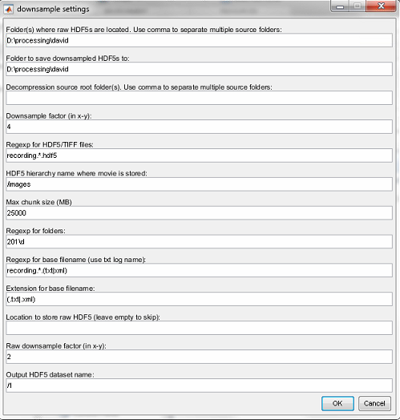
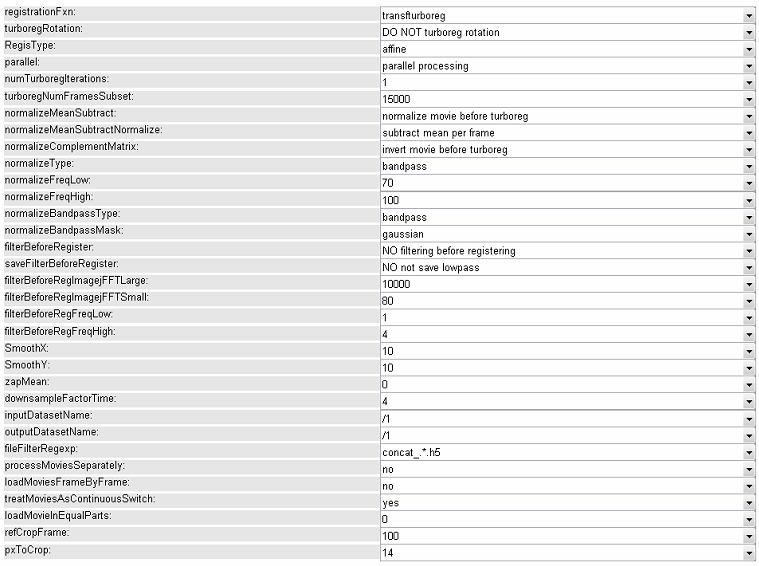
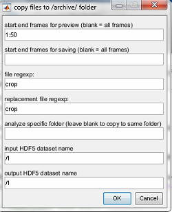
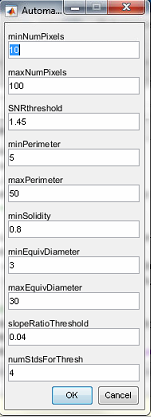

-----------------------------------
# CaRPA
-----------------------------------

## Batch-processing code
-----------------------------------
The core of the code is the behavior analysis object

<br><br>
### Instantiate a behavior analysis object to start processing the data

```matlab
    myObj = carpa;
```

<br><br>
### Bring out the pipeline options

```matlab
    myObj.runPipelineProcessing
```

<br><br>
### modelDownsampleRawMovies:

Spatially downsamples the movies. Hdf5 -> concat_[...].h5




> Using the regular expression field we can downsample a bunch of .hdf5 into different folders.


<br><br>
### modelAddNewFolders

To add the folders where the .h5 files are located. Necessary for modelPreprocessMovie (for example).

<br><br>
### modelPreprocessMovie

This brings the preprocessing options. Upon opening, the cell method extraction is asked:
1. PCAICA (Mukamel, 2009)
2. CELLMax (Lacey)
3. EXTRACT (Hakan)
4. CNMF (Pnevmatikakis, 2015)
5. ROI

> This is usually asked in many methods, but only actual matters in a few.


Next, the program displays a list, and asks to choose:

1. Mouse
2. Session

    > It probably uses the data inside the .h5, or the filename, to extract this data.
    
3. Folder sorting filter.

    > To restrict folders or files fulfilling certain conditions.

4. Folder

Then, the actual preprocessing options are displayed:

1. Turboreg
2. fft_highpass
3. crop
4. dfof
5. downsampleTime
6. fft_lowpass

We chose all of them but the filters.

Then, we can select at which stages to save a file.

> It is a good idea to save a version with and without downsampleTime. Extracting the cells is easier in time downsampled movies, but we lose temporal resolution when getting the traces later.

The output of the preprocessing is yet another .h5


<br><br>
#### modelPreprocessMovie: turboreg

Used for aligning the cells. We are asked to select a spatial portion of the video, and to select the frame range to use. Only the selected portion will be aligned. Therefore, it is good to select a zone with some landmark, usually small veins are a good option.



- NumFramesSubset: Divides registration into chunks to save RAM.
- normalizeType: Has no effects on the movie, only for registration.

    > If registration fails, change this to **matlabdisk**
    
- filterBeforeRegister: Has effect on the movie. 

    > Use MATLAB divide by lowpass.
    
- loadMovieInEqualParts: all movies in the folder are considered one session and are registered together
- refCropFrames: does the registration averaging frames


> In intertrial only afine (without rotation) transformations are used. In intertrial rotations are included.

> In windows TURBOREG may not work because of #c libraries (all pixels suddenly drop intensity, can be seen in TURBOREG visualizer. Use MATLAB registration instead (imtransform). 

Next, we can choose if we want to use the same registration coordinates across multiple folders, only when the subject is the same, or not at all. We select this last option.

<br><br>
### modelPreprocessMovie: cropping

> The cropped section will in fact be replaced by NaNs

> The cropped selection works for TURBOREG alignment. It should minimize the black spaces resulting of moving the individual frames in the registration.

<br><br>
### modelModifyMovies

This allows to mask a non-square part of the video that do not interest us, and that may display heavy flickering that misleads the ICAs.

> The masked section will be zeroed



- File regexp: Regular expression within the file we want to mask.

<br><br>
### modelExtractSignalsFromMovie

Different methods to extract signals. 

<br><br>
### modelExtractSignalsFromMovie: PCAICA

You have to give the number of PCA and ICA components.

> On method selection (the second method selection popup), if necessary, use second PCAICA version for compatibility.

> To chose ICA start high (2000 or so), and look in the shape information at which ICA count a sharp drop occurs. Then, redo the extraction with this ICA number. 

> If the shape information is not readily available the second time, use "Get model vars".

> PCA should be 150% of the ICA number.



> What does the above popup control?

Creates the *pcaicaAnalysis.mat* file. Also saves pictures and logs (like the next functions) at *./private/[...]/_date_*

<br><br>
### modelExtractSignalsFromMovie: CELLMAX

Two possible initialisations, grid and ICA. 

> Cellmax has the particularity that the number of cells is not decided a priori. 

> If grid initialisation is selected, the cell priors are estimated from a grid initialized by asking the user the locations and sizes of two neighboring cells.

> If ICA initialisation is selected, the cell priors are estimated from ICA. You cannot select the number of ICA to use, and usually results in an excessive number of false cells.

> If there is more than one folder to extract, the initialisation is only performed once. This may be a problem if the movies change considerably.

<br><br>
### modelVarsFromFiles

Loads information of the PCAICA into the object.

> Basically, if the current method crashes, use this. If it still does not work, clear all and restart the object. If it still does not work, debug the issue.

<br><br>
### computeManualSortSignals

Allows to manually select the good ICA filters. In the top left, there are the event averages and the ic, in the top middle the movies of the events. By choosing if the filter is correct, it creates a decisions file.

> If the program crashes, the decisions file with all the decisions until the crash can be found at *./private/temp*

> Depending on the threshold more weak spikes will be shown for each potential filter. The criteria should therefore be on the general plausibility of the filter, not its accuracy in each and every one of the detected events.

> The s ratio is the AUC before the peak compared to the arc after the pic. It should ideally be around 1.

<br><br>
### classifyManualSortSignals

This takes ground data consisting on the manually annoted sessions and classifies the rest of the sessions. 

> It is possible to manually annote the first, middle and last day, and classify the rest.

> Use the confusion matrix to assess classification success (overfitting?)


<br><br>
### viewCreateObjMaps

Creates the cell maps and traces. 

> If there is no decision file specified for the selected method, the cells are automatically filtered by some criteria.

<br><br>
### computeMatchObjBtwTrials. 

Aligns the cells. Different versions, using global aligning or matching the rest on the first one.

> Uses nonrigid registration (allow rotations). 

> Sorts both the shapes and the centroids, and iterates between them. 

> 3 rounds (up to 5)

> Aligns up to 5px (12um)

> The .globalIDs are the files with the results of the registrations across sessions. It is a surface, the x-axis are the sessions, and the y axis are the cellID. If the cells could not be match then (session,cellID) = 0.

> To find all the aligned cells in session 1 use:

```matlab
    >> length(obj.globalIDs.mouse2026(:,1))-sum(obj.globalIDs.mouse2026(:,1)==0)
```


