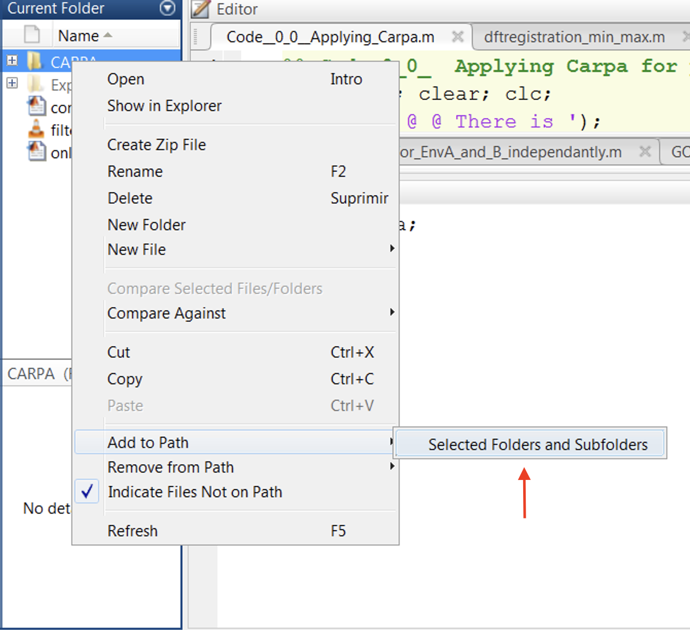
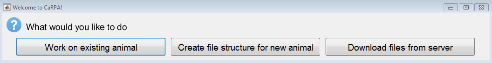
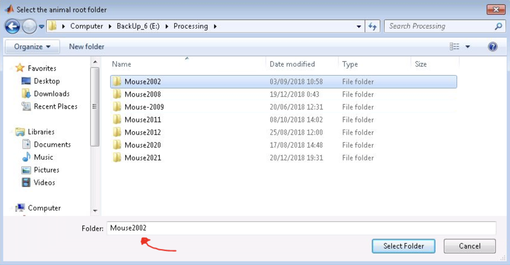
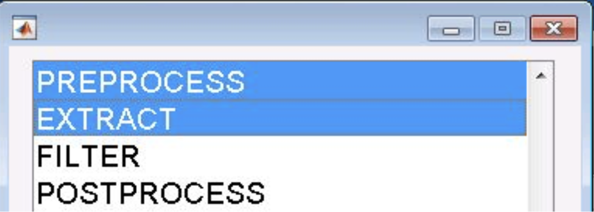
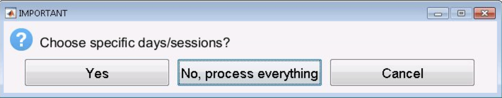

-----------------------------------
# CaRPA TUTORIAL
-----------------------------------
Calcium Recordings Processing and Analysis


## 1. Starting CaRPA:
	
To use CaRPA, first make sure the CaRPA folder is in MATLAB's path.
 
 
 
Next, create an instance of the CaRPA object:

```
carp = carpa;
```
A menu will show up, listing several options:




### 1.1. Work on an existing animal:
		
For working with a folder with calcium recordings, already sorted in folders. The required file structure is the following:


| 	      | ROOT FOLDER   →| DAY/EXPERIMENT FOLDER →| SESSION FILES |
| ----------- | ----------- | ----------- | ----------- |
|E.g. 	   | Mouse 5012	   | Mouse-5012-20150228-eightPorts 	        | concat_recording_20150228_114834.h5|
|	   |		   |  					        | concat_recording_20150228_120021.h5|
|     	   |               | Mouse-5012-20150228-linearTrack		| concat_recording_20150228_192756.h5|
|	   |		   | Mouse-5012-20150301-eightPorts 	        | concat_recording_20150301_114211.h5|
|	   |	           |					        | concat_recording_20150301_115923.h5|

		
CaRPA will ask for the root folder. It is only possible to use an instance of CaRPA on one root folder at a time.

**IMPORTANT:**

> When selecting the root folder, make sure the name of the folder you have selected appears  in the window as show below. 

 

**IMPORTANT:**

>This exact syntax of the folder name is important for CaRPA to understand the different fields:

> Mouse-XXXX-YYYYMMDD-EXPERIMENT. e.g.     Mouse-5012-20150228-eightPorts 
       e.g.     Mouse-5012-20150228-eightPorts 

**IMPORTANT:**

> If a given day has two different experiments, they should go in different folders (see example above).    To change the experiment names in a convenient name, use the command:
```
carp.setExperimentNames;
```


### 1.2. Create file structure for a new animal

Creates the file structure described in the previous point from a folder with several calcium_recording files. For this to work properly, the first number sequence in the file name should correspond to the day of the recording, e.g.  concat_recording_20150228_192756.h5

**IMPORTANT:**

> In CaRPA, spatially downsampled non-processed calcium files are called concat_recording_*YYYYMMDD*_*hhmmss*.h5. 


### 1.3. Download files from server

Allows to download one or more sessions of an animal directly from the cluster. The path of the server is defined by the archiveRawCaPath property. To change it use the command:

```
carp.archiveRawCaPath = ‘‘C://new_path’’;
```

It is assumed that in the path folder there are folders for the different animals, and inside each animal folder there are folders for the different days, in a similar manner as the folder structure specified in 1.1. 

This function will also decompress .raw files using the Inscopix Decompressor. For this to work the nVistaHD decompressor must be installed on the system, the file raw2xxx.py must exist in the nVistaHD directory, and the file InscopixDecompress.bat must be visible by Matlab. The InscopixDecompress.bat file contains the installation directory of nVistaHD, which is by default: C:\Program Files\Inscopix\nVistaHD\.

Finally this function will spatially downsample calcium files which do not begin by concat_recording*. It will also spatially downsample newly decompressed files. The amount of spatial downsample is defined by the propriety spatialDS, and can be changed by using the command:

```
carp.spatialDS = 4;
```

**IMPORTANT**

>The custom interface to connect to the server is mysftp, which uses the SSH2 library. Therefore, this library and the custom interface must be in the matlab path for this function to work. Besides, a username and password must be provided before connecting to the server.

## 2. The folder structure

CaRPA organizes your files in a folder structure. This is a list of the files CaRPA understands:

FILE
DESCRIPTION
SYNTAX
concat
Unprocessed, spatially downsampled ca files.
concat_recording_*YYYYMMDD*_*hhmmss*.h5
dfof
Processed ca files.
Mouse-*XXXX*-*YYYYMMDD*_*hhmmss*&*hhmmss*&...*-EXPERIMENT*-dfof.h5
downsample
Temporally downsampled processed ca files.
Mouse-*XXXX*-*YYYYMMDD*_*hhmmss*&*hhmmss*&...*-EXPERIMENT*-dfof-downsampled.h5
analysis
.mat files with extracted cells and traces.
Mouse-*XXXX*-*YYYYMMDD*_*hhmmss*&*hhmmss*&...*-EXPERIMENT*-emAnalysis.mat

OR 
 
Mouse-*XXXX*-*YYYYMMDD*_*hhmmss*&*hhmmss*&...*-EXPERIMENT*-pcaicaAnalysis.mat
decisions
.mat files with cell decisions.
Mouse-*XXXX*-*YYYYMMDD*_*hhmmss*&*hhmmss*&...*-EXPERIMENT*-emAnalysisSorted.mat

OR 
 
Mouse-*XXXX*-*YYYYMMDD*_*hhmmss*&*hhmmss*&...*EXPERIMENT*-ICDecisions.mat
behavior
.avi files with animal behavior.
.avi
logs
.log files with recording data.
.txt OR  .html
tracesEvents
.mat files with the final processed traces and position data.
Mouse-*XXXX*-*YYYYMMDD*_*hhmmss*&*hhmmss*&...*-EXPERIMENT*-TracesAndEvents.mat
other
Other files
*


The folder structure is accessed using the property folderStruct, and it is updated every time it is modified. However, you can manually update the folder structure by using the command:

```
carp.buildFolderStructure;
```

## 3. Processing the data

By default CaRPA tracks the processing stage of the different sessions and only shows and applies the selected processing stages to files which have not been yet processed on those stages. To change this behavior and view/process all available sessions, regardless of preprocessing stage, change the propierty showProcessed to 1:

```
carp.showProcessed = 1; (Not recommended)
```

To start the processing, type the following command into the console:

```
carp.menu;
```

This will bring up a menu with different processing options. Select one or more options and click ok.

 

This will bring up a menu with different processing stages. Select one or more options and click ok.

If a single processing stage is selected a menu will pop up next, which allows to process all available sessions or choose specific ones. 

 

If more than one stage is selected all the corresponding sessions will be processed.

## 4. Carpa Outputs

Traces_Events

rawProb 
time x neurons 
maximum likelihood dfof of each neuron, given by the CELLMAX algorithm


rawTraces
time x neurons 
dfof value of each neuron
position
time x coordinates
detected tracker position.


velocity
time 
absolute velocity


tresholdEvents
time x neurons 
whether there is a spike at each time given by the thresholding algorithm method developed by Biafra:
\miniscope_analysis-bahanonu-miniscopeAnalysisClass_18_08_17\signal_processing\computeSignalPeaks.m
spikeDeconv
time x neurons
whether there is a spike at each time given by the spike deconvolution algorithm from Pnevmatikakis et al 2013. Bayesian spike inference from calcium imaging data 
https://github.com/zhoupc/OASIS_matlab
spikeML
time x neurons
whether there is a spike at each time given by the spikeML algorithm from :
Deneux T, Kaszas A, Szalay G, Katona G, Lakner T, Grinvald A, et al. Accurate spike estimation from
noisy calcium signals for ultrafast three-dimensional imaging of large neuronal populations in vivo. 2016
https://github.com/MLspike/spikes
spikeDeconvTrace
 time x neurons
denoised df/f traces given by the spike deconvolution algorithm


cellAnatomicLocat
neurons x coordinate
location of each neuron centroid


